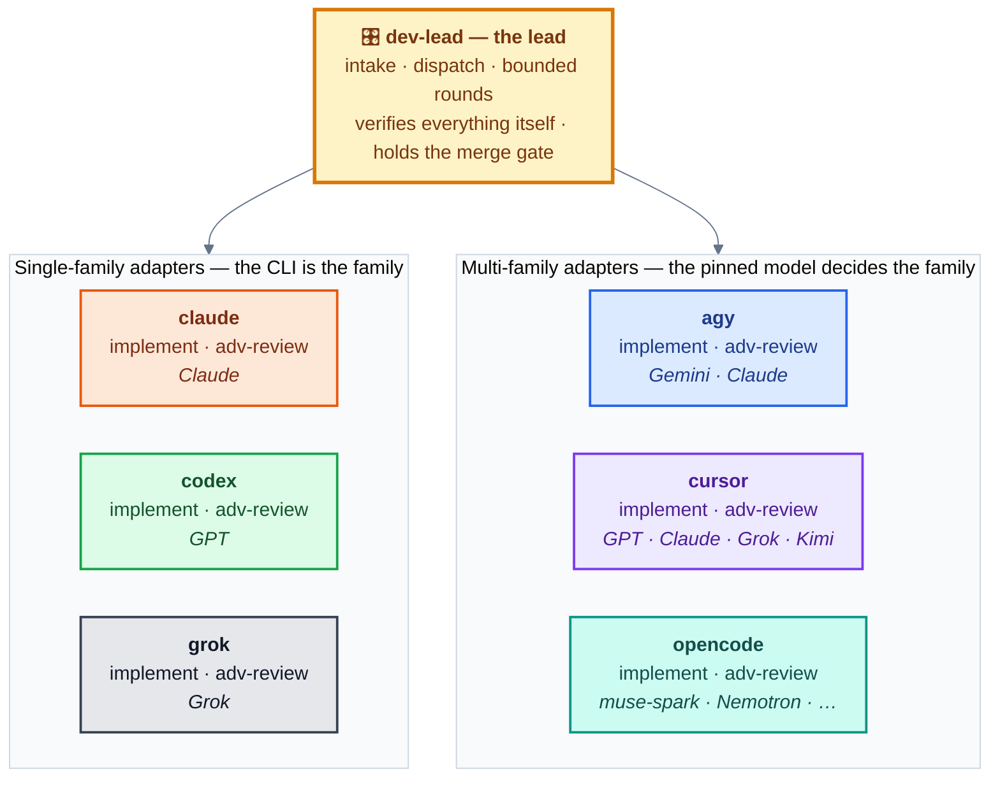
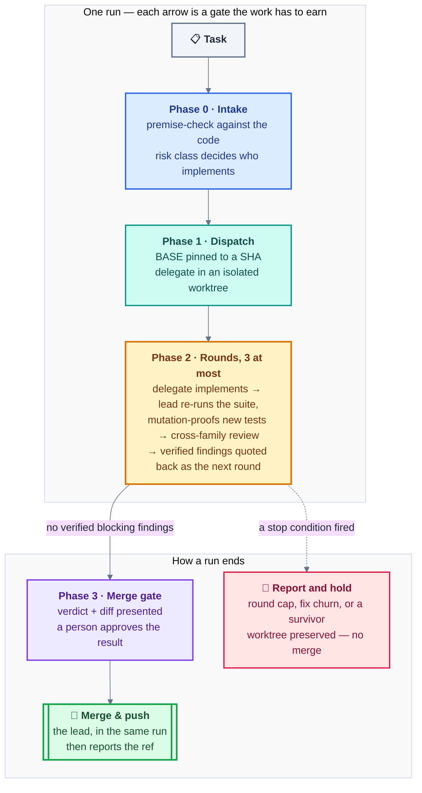

<div align="center">

# dev-lead

**Cross-model delegation & adversarial review for CLI coding agents**

[](https://github.com/aarontzeng/dev-lead/actions/workflows/ci.yml)
[](https://github.com/aarontzeng/dev-lead/releases)
[](#whats-in-the-box)
[](#whats-in-the-box)
[](#install)
[](LICENSE)

One agent leads. Others implement. **No change ever merges reviewed only by
its own model family** — and nothing a delegate says about its own work is
taken on trust.

</div>

---



> [!IMPORTANT]
> **Adapters are not families.** The six boxes are *runtime adapters* —
> which CLI you drive. The cross-family rule is accounted in *model
> families* — whose training produced the output — and one adapter can serve
> several: agy exposes both Gemini and Claude pools; cursor pins whichever
> model you name; opencode serves muse-spark, Nemotron, and stealth models
> whose family is undisclosed. Every dispatch records the **adapter**, the
> **model actually served** (some adapters silently substitute — the runtime
> files show how to verify), and that model's **family**. The family column
> is the one the review rule reads; [`data/families.json`](data/families.json)
> is the machine-readable version the linter checks the docs against.

## In one minute

```bash
claude plugin marketplace add aarontzeng/dev-lead
claude plugin install dev-lead@dev-lead
```

Then, inside Claude Code, hand the lead a bounded task and say who does what:

```text
/dev-lead Implement the settings-page consolidation (roadmap item A).
          Delegate to codex gpt-5.6-terra; review with agy and opencode.
```

What happens next is the diagram below: the lead premise-checks the task
against the code, pins a base commit, dispatches into an isolated worktree,
re-runs the suite itself, watches every new regression test fail before it
passes, sends the frozen diff to reviewers from *other* families with
*different* briefs, verifies each finding against the code, and stops at the
merge gate: you approve the verdict and the diff, the lead merges, pushes,
and reports the resulting ref.

| Measured, not asserted | |
|---|---|
| **≈0 % overlap** | between the principal findings of parallel reviewers given *different briefs* (sequences / challenge / consistency / staleness) — extra legs pay only when the brief changes |
| **1 → 17 routes** | what one demand — "give the exact command and how many results it returned" — did to a single leg's enumeration on the same question |
| **3 readers missed, 1 executor found** | a cross-tenant leak that three reading legs (two of them frontier models) passed and the one executing leg reproduced in one round |

## Why

Every coding model has blind spots, and a reviewer that shares the author's
training shares the author's blind spots. Running a *second context* of the
same model is a fresh look — not model diversity. This suite makes the
cross-family rule structural:

| Principle | In practice |
|---|---|
| 🚫 **No self-family review** | GPT implemented → Gemini, Claude, or a named free-pool model reviews. HIGH-risk work takes **two** reviewers from two other families |
| 🔒 **Machine-enforced boundaries** | Read-only permission configs, sandboxes, and allow-lists — not "please don't edit anything" |
| 🧪 **Nothing trusted on self-report** | The lead re-runs tests itself, mutation-proofs every new regression test, and verifies every review finding before acting |
| 🙋 **A person approves the result; the lead lands it** | The verdict and the diff get a human yes — then merging and pushing are the lead's to do, in that run, without a second ask. Delegates never push |

## How a run flows



Each arrow hides a gate that has to be *earned* — a premise checked against
the code rather than trusted, a suite the lead re-ran itself, a regression
test watched failing before it was allowed to pass.
**[docs/workflow.md](docs/workflow.md)** expands this into the full phase
diagram, a round-by-round sequence, what each phase owes the next, and the
six adapters side by side (including how each one really enforces no-push —
one of them only by accident).

## What's in the box

| Skill | Role |
|---|---|
| `dev-lead` | The orchestration layer: intake → dispatch → bounded review rounds → merge gate |
| `claude-implement` / `claude-adversarial-review` | Claude Code as a headless delegate (`claude -p`) |
| `codex-implement` / `codex-adversarial-review` | OpenAI Codex via its Claude Code companion plugin — or the raw CLI |
| `agy-implement` / `agy-adversarial-review` | Google Antigravity CLI (Gemini + a separate Claude pool) |
| `opencode-implement` / `opencode-adversarial-review` | OpenCode's free pool (muse-spark, Nemotron, …) — zero quota cost |
| `grok-implement` / `grok-adversarial-review` | xAI's Grok Build CLI — a paid pool, tier peer of codex/agy, and a sixth accounting family (integrated 2026-08-13; no field-proven round yet) |
| `cursor-implement` / `cursor-adversarial-review` | Cursor's CLI (`cursor-agent`) — one paid adapter serving GPT, Claude, Grok, Kimi, Composer, and auto; the pinned model decides the family (integrated 2026-08-13; field-proven as a standing review leg since 2026-09) |

Each family also carries a **runtime reference**
(`skills/<family>-adversarial-review/references/<family>-runtime.md`) holding
its operational mechanics: permission traps, silent failure modes, auth
diagnosis, model catalogues. Every item in those files was paid for with a
real incident, and each is dated so you can judge freshness.

The lead role is portable: all six CLIs can read the same skills directory,
so a Codex or Gemini lead can follow the same playbook and delegate to
Claude via `claude-implement`.

## The discipline

The full version is [docs/methodology.md](docs/methodology.md). The parts
people most often get wrong:

1. **Freeze the review target.** Review a committed SHA in a directory
   nothing else touches. The base of a topic branch is the **merge-base**,
   never the target branch name — and `git diff A..B` is *not* merge-base
   semantics (`git log A..B` is; use `git diff A...B` or pin `$BASE`).
2. **Evidence gates with unguessable anchors.** A reviewer that "found
   nothing" and a reviewer that never opened the file produce identical
   output. Require per file: line count *and* the verbatim last line; per
   claim: `file:line` plus the quoted code. `NOT REACHED` is an acceptable
   verdict; `HOLDS` without a quote is not.
3. **Bounded properties.** An unbounded claim ("handles any input") can
   never converge — every round legitimately finds one more case, forever.
   Declare the approximation's scope in the code and review against the
   boundary.
4. **Mutation-proof regression tests.** A new test that passes proves
   nothing until you've watched it *fail* against the un-fixed code. The
   catalogue of ways this goes subtly wrong lives in `dev-lead` Phase 2 —
   stale binaries, combined reverts, tests that pass for the wrong reason.
5. **Ask what the tests do not enumerate** — in those words. It reliably
   produces the highest-value review output: the state-space regions no
   test covers, and the tests that pass for the wrong reason.
6. **Give parallel reviewers different briefs, not just different models.**
   Sequences, challenge ("is this the right approach at all"), consistency,
   staleness — measured on real rounds, differently-briefed legs' findings
   overlap near zero percent.

## Install

**As a Claude Code plugin** — this repo is its own marketplace:

```bash
claude plugin marketplace add aarontzeng/dev-lead
claude plugin install dev-lead@dev-lead
```

Skills then load namespaced (`dev-lead:codex-implement`,
`dev-lead:dev-lead`, …). `claude plugin marketplace update dev-lead`
pulls later versions.

**Or symlink the skills** (no plugin machinery):

```bash
git clone https://github.com/aarontzeng/dev-lead ~/dev-lead
ln -s ~/dev-lead/skills/* ~/.claude/skills/
```

> [!NOTE]
> Keep the clone **and** export `DEV_LEAD_ROOT=~/dev-lead`. The skills
> resolve their own tree — the `scripts/` helpers and the `docs/` they cite
> — from the plugin cache by default, and a bare `skills/*` symlink leaves
> no cache entry to find. `DEV_LEAD_ROOT` is the override for exactly this
> install. (It is also why the skills never spell a suite path relative to
> the cwd: a skill runs with the *target* repo as cwd, so `scripts/…` would
> resolve against whatever project you are working on.)

**To try it without installing**: `claude --plugin-dir /path/to/dev-lead`
loads a local checkout for one session — set `DEV_LEAD_ROOT` to that same
path, because a `--plugin-dir` session leaves no cache entry for the
`scripts/` helpers to resolve against.

**For the other CLIs** — point each CLI's skills/context location at the
same tree; the exact path is version-dependent (Codex has documented
`$HOME/.agents/skills` as its skill location, with symlinked folders
supported; older setups used `~/.codex/skills`; check your CLI's current
docs):

```bash
ln -s ~/.claude/skills "$HOME/.agents/skills"            # codex (verify per your version)
ln -s ~/.claude/skills ~/.gemini/antigravity-cli/skills  # agy
```

Or skip symlinks entirely: drop [templates/AGENTS.md](templates/AGENTS.md)
into your project root (see Portability below).

### Prerequisites

You need at least **two families** installed for the cross-family rule to
mean anything. Each family's runtime reference lists its one-time setup
(permission allow-lists, config schemas). The suite assumes two standing
rules — adopt them in your own agent instructions if you don't have them:

- **Delegates never push.** They commit locally and report the hash; the
  lead pushes only after a person has approved the result, and only to the
  ref your project's contract names (a review ref, a topic branch, or the
  target branch where that is allowed).
- **No AI-authorship trailers** in commit messages (adjust to your team's
  policy).

## Portability

| Tier | Agents | What you get |
|---|---|---|
| 🥇 **First-class** | Claude Code | Plugin install, automatic skill discovery and invocation. Works out of the box |
| 🥈 **Supported, field-proven** | codex, agy, opencode, any shell-capable CLI | The SKILL.md files are plain Markdown and every mechanism is bash/git. A codex-led run has completed the full workflow end-to-end. Enter via symlink or [templates/AGENTS.md](templates/AGENTS.md) |
| 🥉 **Methodology only** | Copilot and other IDE-embedded agents (Cursor's IDE side lands here too — its CLI is a full adapter above) | [docs/methodology.md](docs/methodology.md) and [docs/calibration-journal.md](docs/calibration-journal.md) as rules-file reading material. The workflow's core motion — background delegates, 5–40 min waits, worktree orchestration — is not an IDE agent's interaction shape, and this suite deliberately does not contort itself to change that |

> [!NOTE]
> Tier-2 caveat: the codex family skills drive codex through its **Claude
> Code companion plugin** by default (job tracking, managed sandboxes). On a
> machine without Claude Code, use the **raw-CLI fallback** documented in
> [codex-runtime.md](skills/codex-adversarial-review/references/codex-runtime.md)
> — same workflow, honestly-listed reduced guarantees.

## Research briefs — fanning out a question instead of a change

The suite's third role, beside implement and review. A lead splits a problem
into falsifiable questions, dispatches them through the *existing* review
adapters (there is no `*-research` skill and there should not be — the runtime
adapter is the expensive part and it is role-independent), verifies every
returned fact, and writes the plan itself. Legs return facts with citations;
legs never write plan prose.

[docs/research-briefs.md](docs/research-briefs.md) is 23 rules, each one a
measurement with the failure that produced it attached. The two that cost the
most to learn:

- **Demand a completeness argument you can re-run** — "give the exact command
  and the number of results it returned", not "say what search establishes
  this". Measured: that single demand, not the question's phrasing, turned a
  one-route answer into a seventeen-route enumeration from the same leg on the
  same question. It makes an answer *checkable*, not checked — the pilot's best
  enumeration still carried a false completeness claim, self-rated 1.0.
- **Ask whether the leg can execute.** Three reading legs, two of them frontier
  models, missed a cross-tenant content leak that the one executing leg
  reproduced in a single round.

Most of the rules are about the lead's own instruments rather than the
delegates', which was not the expected shape.

## The calibration journal

The model tables in these skills ship with *structure*, not *your numbers*.
Which model is best at which role changes with every release, every quota
tier, and every codebase.
[docs/calibration-journal.md](docs/calibration-journal.md) describes the
practice this suite is really about: measure your own delegates, date every
entry, and never conclude from n=1 — free pools are flaky by design, and
single observations cannot distinguish a broken model from a congested
queue from your own prompt bug.

## Provenance & contributing

Extracted from a working multi-CLI setup where this workflow shipped real
production changes through implement → cross-family review →
mutation-proofed merge cycles. Dates on measured claims are when they were
observed; treat anything version-pinned (CLI flags, sandbox behavior, model
catalogues) as a snapshot to re-verify, not gospel.

**Pull requests with *measured* corrections — what you observed, when, on
what version — are the most valuable kind.**

CI is `python3 scripts/lint.py` (stdlib only — run it locally before a PR).
Each check guards an invariant this repo has actually shipped a violation
of; the script's docstring names which. If you add an invariant, add its
check, and mutation-test it: break the invariant, watch the check fire,
restore.

## License

[MIT](LICENSE)
