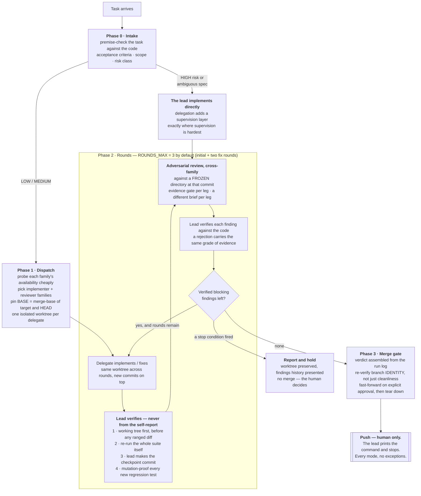

# How a run flows

This is the *what happens*: the shape of a run from a task arriving to a
human typing `git push`. [methodology.md](methodology.md) carries the *why*
each step is shaped that way, and the `SKILL.md` files carry the executable
detail — commands, flags, and the traps each CLI hides. Read this one first;
it is the map the other two assume you already have.

## The four phases



Two edges in that diagram carry most of the argument:

- **`L --> R3`** — work the lead implemented itself still goes through
  cross-family review. The lead's own verification shares the lead's blind
  spots, so skipping review for "I wrote it myself" removes exactly the
  independence the role exists to supply.
- **`R5 -->|a stop condition fired|`** — not every run ends in a merge, and
  a run that stops with its worktree intact and its findings written down is
  a successful run. Looping until something looks green is the failure mode.

## What each phase owes the next

| Leaving | Requires |
|---|---|
| **Phase 0** | Acceptance criteria a machine can check · the files a correct change should touch · a risk class · the task's factual premises checked *against the code*, not taken on trust |
| **Phase 1** | The chosen family probed as available **this run** (stale logs describe past runs) · `$BASE` pinned once to `git merge-base <target> HEAD` · one isolated worktree per delegate · `refs/remotes` snapshotted so an accidental push surfaces as a delta |
| **A round** | The lead re-ran the suite *itself* · the lead made the checkpoint commit · every new regression test was watched **failing** against the un-fixed code · every finding recorded with its fate, rejections included and evidenced |
| **Phase 3** | No verified blocking findings open · branch *identity* re-verified at the gate · explicit human approval of the diff |
| **Always** | Push never leaves the human's hands |

## One round in detail

```mermaid
sequenceDiagram
    autonumber
    participant U as Human
    participant L as Lead
    participant W as Worktree (isolated)
    participant D as Delegate (implementer)
    participant R as Reviewer (another family)

    U->>L: task + acceptance criteria
    L->>L: premise-check against the code; assign risk class
    L->>W: git worktree add -b family/slug $BASE
    Note over L,W: snapshot refs/remotes now, diff it at handoff
    L->>D: task file — scope, existing test seams,<br/>where new tests belong, the no-push rule
    D->>W: writes files (whether it can commit is family-dependent)
    D-->>L: self-report
    Note over L: a self-report is not evidence
    L->>W: git status --short, git diff — BEFORE any ranged diff
    L->>W: re-run the full suite
    L->>W: stage in-scope paths, make the checkpoint commit
    L->>W: mutation-proof each new test — watch it FAIL first
    L->>R: review the frozen commit<br/>evidence gate + this leg's own brief
    R-->>L: findings
    Note over L: findings are hypotheses, not verdicts
    L->>L: verify each against the code;<br/>rejections carry refuting evidence
    alt verified blocking findings, rounds remain
        L->>D: next round — each finding quoted verbatim,<br/>why it is real, what fix is required
    else clean, or a stop condition fired
        L->>U: verdict + diff stat against $BASE
        U->>L: explicit approval
        L->>W: fast-forward merge, tear down worktree
        L->>U: prints the push command — the human runs it
    end
```

The ordering inside the lead's verification block is not cosmetic. A
`$BASE...HEAD` range against an uncommitted tree is **empty**, and an empty
range reads exactly like a clean scope check — a measured false green. Look
at the working tree first, commit second, range third.

## The adapters, side by side

Four runtime adapters, each usable as an implementer or a reviewer. Model
names are deliberately absent: catalogues change every few weeks, and the
suite ships *structure*, not somebody else's benchmark — see
[calibration-journal.md](calibration-journal.md).

| Adapter | Families it can serve | Write leg | Review leg | How "no push" is really enforced | Worktree |
|---|---|---|---|---|---|
| **claude** | Claude | `claude -p --permission-mode acceptEdits` | `claude -p --permission-mode plan`, MCP servers stripped — otherwise the leg hangs on server startup | **Instruction level only.** No machine allow-list; it inherits the operator's standing rules. Observed refusing and printing the command instead | Required when driven as a worker for a foreign lead |
| **codex** | GPT | companion `task --write --fresh`, workspace-write sandbox | companion `adversarial-review`, read-only sandbox | **Structural, and by accident.** The sandbox cannot commit in a worktree at all — the shared git index sits outside it — so the precondition for pushing is never reached | Always |
| **agy** | Gemini **and** a separate Claude pool | `--mode accept-edits --sandbox --add-dir` | `--mode plan --sandbox --add-dir` | **Machine allow-list**, enforced by omission: push/reset/checkout/clean/worktree are simply absent. One deliberate hole — the test runner is allow-listed, so *inside a test process* the boundary drops back to instruction level | Always |
| **opencode** | DeepSeek, Nemotron, and stealth models whose family is undisclosed | write `opencode.json` (`bash:*:allow` plus explicit denies) | read-only `opencode.json` (`bash:*:deny`, a few git reads allowed, `edit:deny`) | **Machine config — with an ordering trap: last match wins.** The wildcard must come *first* and the denies *after*, or the denies never fire | Always |

> [!IMPORTANT]
> The family column is the one the cross-family rule reads, and it is a
> property of the **served model**, not the adapter. One adapter can serve
> several families, and an adapter may silently substitute the tier you
> asked for — so every dispatch records adapter, *verified* served model,
> and family as three separate fields. A model whose family is undisclosed
> can never *satisfy* the rule: fine as an extra pair of eyes, never the
> accounting leg. The machine-readable version of this model is
> [`data/families.json`](../data/families.json).

> [!NOTE]
> **Denial ergonomics differ, and it matters when you are debugging.** A
> blocked command under `opencode` is reported to the model, which says so
> and continues; the same block under `agy` can kill the whole run with zero
> output, which looks identical to a congested pool or a bad prompt. Each
> family's failure signatures — and the probe that tells them apart — live
> in its runtime reference:
> [claude](../skills/claude-adversarial-review/references/claude-runtime.md) ·
> [codex](../skills/codex-adversarial-review/references/codex-runtime.md) ·
> [agy](../skills/agy-adversarial-review/references/agy-runtime.md) ·
> [opencode](../skills/opencode-adversarial-review/references/opencode-runtime.md).

## When a run stops instead of looping

Iteration is where the quality comes from; unbounded iteration is where the
budget dies. Four conditions end a run with a report rather than another
round:

| Condition | What it actually means |
|---|---|
| Round cap reached with verified HIGH findings still open | Hand the findings history to the human. Do not merge |
| A fix round introduces a **new** HIGH finding | Fix churn — the spec or this delegate is wrong for the task |
| The same finding survives two fix rounds | The prompt is failing to transmit it; the lead fixes it directly |
| The same finding **category** keeps reopening against approximation-shaped code | The review property is unbounded, not the code unfixable. Declare the approximation's scope in the code, then re-scope the review to that boundary — *before* the next review is fired |

## Where to go next

- **Why each rule exists** — [methodology.md](methodology.md): the
  cross-family rule, brief diversity, machine boundaries, evidence gates,
  bounded properties, frozen targets.
- **How to run one** — [`skills/dev-lead/SKILL.md`](../skills/dev-lead/SKILL.md)
  is the orchestration layer; the eight family skills under
  [`skills/`](../skills) carry each adapter's mechanics.
- **Mutation-proofing**, the step that most often lies —
  [`skills/dev-lead/references/mutation-runbook.md`](../skills/dev-lead/references/mutation-runbook.md).
- **Measuring your own delegates** —
  [calibration-journal.md](calibration-journal.md). Which model is best at
  which role changes with every release; the tables here ship with structure,
  not numbers.
